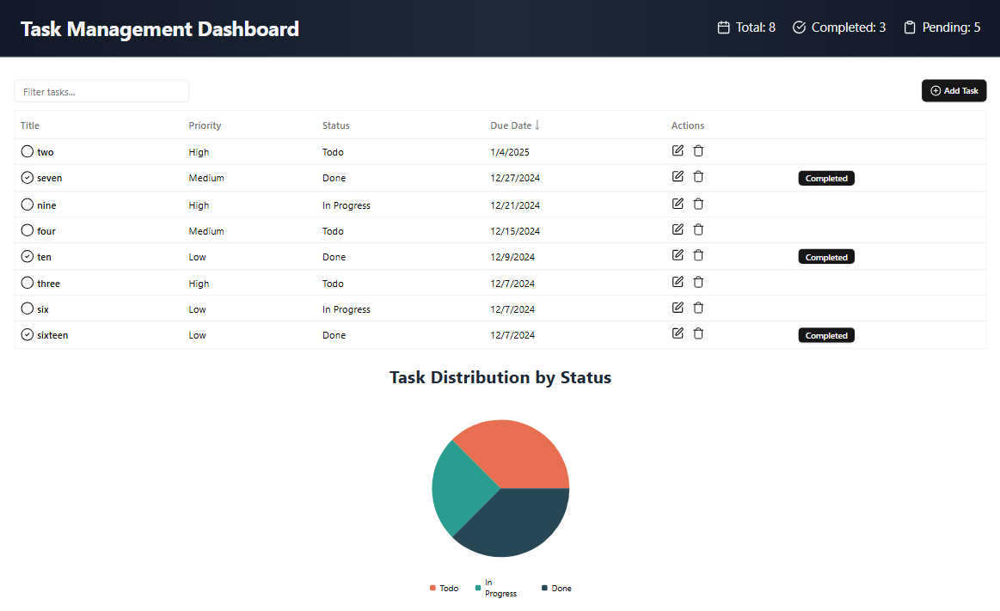
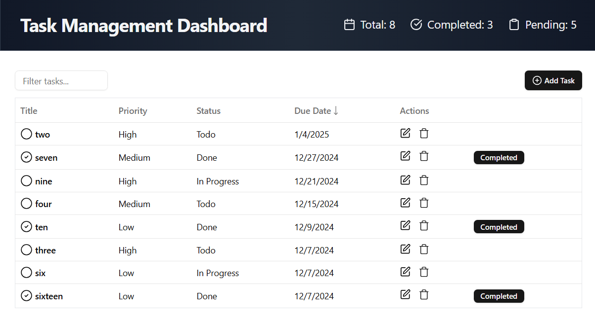
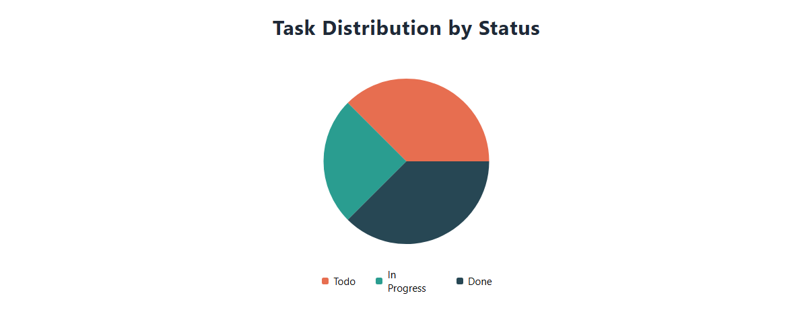

# Task Management Dashboard

A sleek and efficient Task Management Dashboard built with **React**, **Tailwind CSS**, and **shadcn/ui**. This project enables users to organize, track, and manage their tasks seamlessly.

---

## ✨ Features

### 1. **Task List View**

- Display tasks in a table/list format with columns for:
  - **Title**
  - **Priority** (High/Medium/Low)
  - **Status** (Todo/In Progress/Done)
  - **Due Date**
- Search and filter tasks.
- Sort tasks by various columns.

### 2. **Task Management**

- Create new tasks via a modal form.
- Edit existing tasks.
- Delete tasks with confirmation.
- Mark tasks as complete.

### 3. **Dashboard Overview**

- View summary statistics:
  - Total tasks.
  - Completed tasks.
  - Overdue tasks.
- A simple chart showing task distribution by status.

---

## ⚙️ Tech Stack

- **React** for building the UI.
- **shadcn/ui** for pre-built and customizable components.
- **Tailwind CSS** for responsive design and styling.
- **Local Storage** for efficient data persistence.

---

## 📸 Screenshots

### 1. Full App View



### 2. Task List View



### 3. Chart View



## 🚀 Getting Started

### Prerequisites

- Node.js and npm installed.

### Installation

1. Clone the repository:

   ```bash
   git clone https://github.com/Bobby-coder/Task-Management-Dashboard.git
   ```

2. Navigate to the project directory:

   ```bash
   cd task-management-dashboard
   ```

3. Install dependencies:

   ```bash
   npm install
   ```

4. Start the development server:

   ```bash
   npm run dev
   ```
